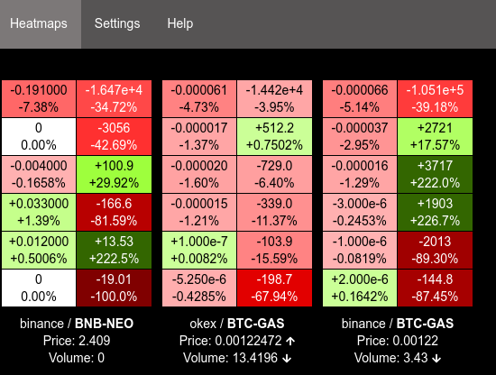
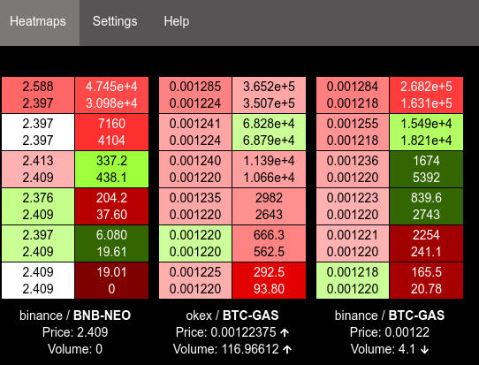
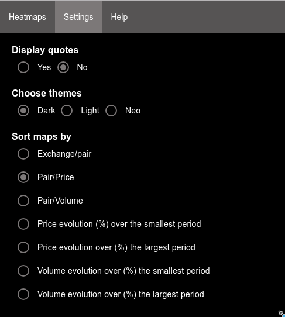

= User interface

== Screenshots

.Delta
[caption="",link=img/delta.png]


.Values
[caption="",link=img/values.png]


.Settings
[caption="",link=img/settings.png]


== Installation

[NOTE]
====
Following should be run in _ui_ subdirectory
====

=== Install dependencies

```
npm install
```

=== Build UI

```
npm run build
```

UI should then be available on http://127.0.0.1:8002/ui/ (assuming _service_ is running on _127.0.0.1:8002_)

== Dependencies

This project was made possible thanks to following projects :

* link:https://www.npmjs.com/package/big.js[big.js]
* link:https://www.npmjs.com/package/font-awesome[font-awesome]
* link:https://www.npmjs.com/package/history[history]
* link:https://www.npmjs.com/package/js-base64[js-base64] (Base64 decoder)
* link:https://www.npmjs.com/package/pako[pako] (zlib port to javascript)
* link:https://preactjs.com[preact]
* link:https://www.npmjs.com/package/wolfy87-eventemitter[wolfy87-eventemitter] to dispatch events
